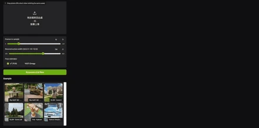
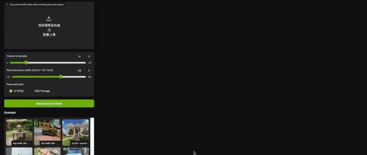

# DVSM: Decoder-only View Synthesis Model

  <a href="https://arxiv.org/abs/2605.29891">Paper</a> | Weights | Online Demo (coming soon)

  
  

DVSM is an end-to-end novel-view synthesis model that reconstructs scenes as latent states and renders views with a single Transformer network. Our model already matches or outperforms per-scene-optimized 3DGS, **even under very dense input views**.

We are still working on the code and model weights release. An improved version is on the way, with better quality, much faster rendering, and support for long sequences.
